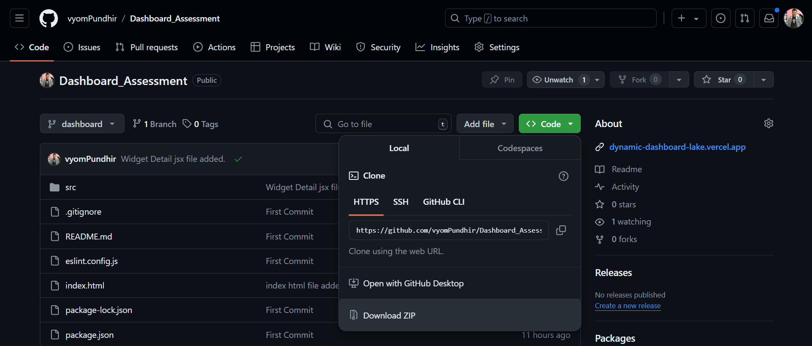
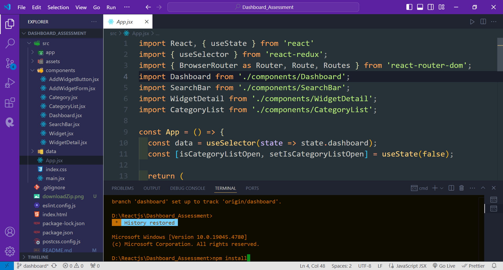
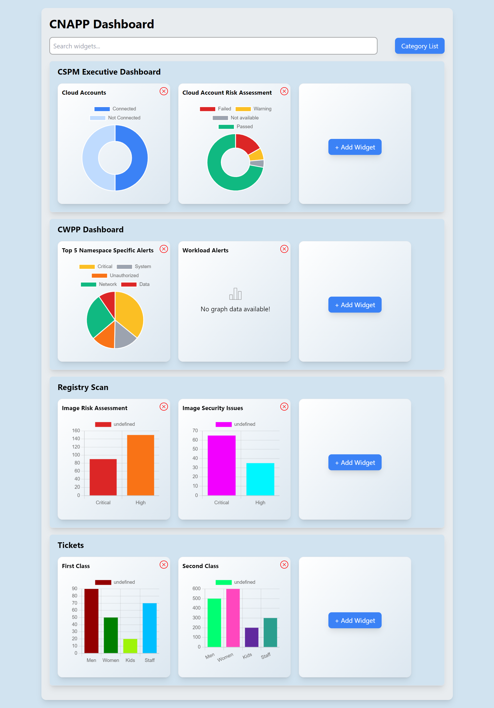

# Project Name : CNAPP Dynamic Dashboard 

---
## How to Download and Run This React Application

This guide will help you download the React application as a ZIP file and run it locally on your computer.

### Prerequisites

Before you start, make sure you have the following installed on your computer:

1. **Node.js** (LTS version recommended) - [Download Node.js](https://nodejs.org/)
2. **Git** (optional but recommended) - [Download Git](https://git-scm.com/)

### Steps to Download and Run

#### 1. Download the ZIP File from GitHub

1. Go to the [GitHub Repository](https://github.com/vyomPundhir/Dashboard_Assessment).
2. Click on the green `Code` button at the top right of the repository page.
3. In the dropdown menu, click on `Download ZIP`.
4. The ZIP file of the repository will start downloading to your computer.

> 

#### 2. Extract the ZIP File

1. Once the ZIP file is downloaded, navigate to the location where it was saved.
2. Right-click on the ZIP file and choose `Extract All` (Windows) or `Extract` (Mac).
3. Choose a location to extract the files and click `Extract`. This will create a new folder containing all the project files.

#### 3. Opening the Folder in the Code Editor (in my case VS code)

1. Open the extracted folder in the code editor.
2. Now, open terminal as shown in the picture and run the command to install dependencies.

    ```bash
    npm install
> 
3. Finally, run the given command in the terminal to run the App on the local host.

    ```bash
    npm run dev
---


## Project Screenshot

> 

---

## You can Check it Live on Below Link :

> [](https://dynamic-dashboard-lake.vercel.app/)

---
